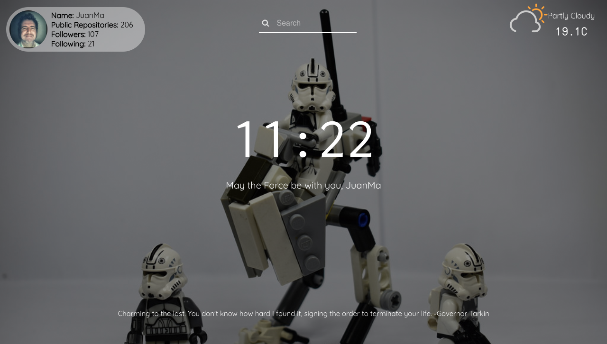

[](http://www.skylabcoders.com/)


### Geekfinity ~ Keep calm and stay geek.

Re-implementación del famoso complemento para navegadores _Momentum_.

Equipo:

+ [Pol Escalera](http://github.com/polescalera10)
+ [Joan Marc Hernández](http://github.com/joanamrc)
+ [Ricardo Martínez](http://github.com/mtzfactory)

### INSTALACION.

Para instalar este proyecto:

```bash
$ git clone https://github.com/mtzfactory/geekfinity-react-project.git
$ cd geekfinity-react-project
$ npm install
$ npm start
```

### PROYECTO ~ modulos.

- WEATHER ~ En este módulo coordinamos dos llamadas a diferentes API, al iniciarse se lanza una para buscar las [coordenadas de tu IP][freegeoip], cuando ésta se completa, se llama a la segunda, que segun la información recibida, devuelve la [previsión del tiempo][wunderground].

- BAKGROUNDS ~ Fondos de pantalla con estilo geek, tomados de diferentes álbums de _Filckr_. Se pueden añadir mas albumes en el fichero _albums.json_.

- QUOTES ~ Random de frases, a partir de varias APIs, o a partir del fichero _quotes.json_.

- SEARCH ~ Módulo para realizar busquedas desde nuestra web, redireccionando la búsqueda de forma random a _Yahoo_, _Google_ o _Bing_. Se puede especificar el buscador introduciendo '_y!_', '_g!_' o '_b!_' delante de la búsqueda.

- LOCALSTORAGE ~ Permite guardar los nombres del usuario y github para recuperarlos al volver a la página.

- PERFIL GITHUB ~ Consulta el perfil del famoso repositorio, mostrando un poco de información de nuestro perfil y pudiendo acceder directamente a este.

- HOC ~ Componente que añade la funcionalidad de actualizar según un intervalo los componentes pasados a través de él.




#### SkylabCoders Academy - Full Stack Web Development Bootcamp


[freegeoip]: https://freegeoip.net/json/
[openweathermap]: https://openweathermap.org/api

[create-react-app]: https://github.com/facebookincubator/create-react-app
[react-router-dom]: https://github.com/ReactTraining/react-router/tree/master/packages/react-router-dom
[hashrouter]: https://github.com/ReactTraining/react-router/blob/master/packages/react-router-dom/docs/api/HashRouter.md
[withrouter]: https://github.com/ReactTraining/react-router/blob/master/packages/react-router/docs/api/withRouter.md